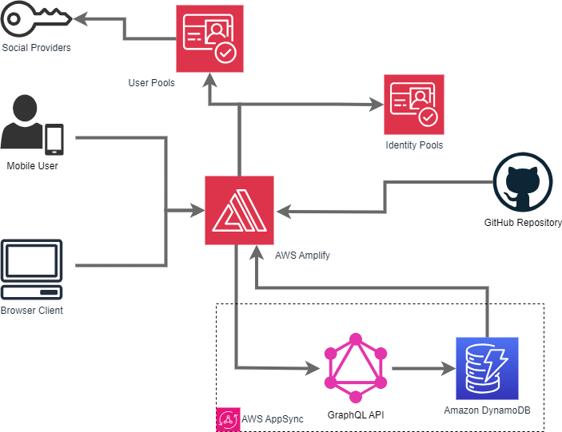

# RecycleScan

Welcome to the GitHub for RecycleScan. RecycleScan is a PWA that uses an AI image classification model to help Kirkland community members recycle correctly, track their progress, and live more sustainability.

Visit https://recyclescan.theplasticproject.org/ to test the app for yourself

Learn more at https://www.theplasticproject.org/recyclescan

## Backend Architecture

This flowchart outlines the backend architecture of our web application, with AWS Amplify at its core. AWS Amplify serves as the central point of contact for both mobile users and browser clients, orchestrating the flow of data and authentication. Here's an overview of the key components:

AWS Amplify (Main Checkpoint):
AWS Amplify hosts and manages our web application.
It handles incoming requests from mobile and browser clients.

Cognito User Pools:
User authentication is managed through Cognito User Pools.
Social identity providers can be connected to offer various login options.

Cognito Identity Pools:
Cognito Identity Pools provide secure, temporary AWS credentials for authenticated users.

AppSync (GraphQL API):
AppSync serves as the GraphQL API layer, facilitating client-server communication.
Clients can execute GraphQL queries and mutations to interact with the backend.

DynamoDB Database:
Data storage and retrieval are managed by DynamoDB, a serverless NoSQL database.
AppSync interacts with DynamoDB based on GraphQL requests.

This architecture ensures a robust and secure backend infrastructure, allowing for user authentication, data storage, and efficient API communication. AWS Amplify streamlines the entire process, making it an ideal choice for hosting and managing web applications.

